# ARCHITECTURE.md — SMT AIQuant Bot v6.1.0

> The structural map (tree + boundaries) **and** the visual maps (Mermaid, see §Diagrams).
> Kept in ONE doc — **update it on every session PR that changes structure** (CLAUDE.md contract).

## Tree

```
smt/
├── daemon.py            # THIN loop + logging + orchestration (no trading logic)
├── core/
│   ├── trade_plan.py    # @dataclass TradePlan / ExitDecision / HoldDecision
│   ├── execution.py     # WEEX V3 algoOrder client + lane-suffix stripper + partial-close/break-even
│   ├── tracker.py       # in-memory positions + WEEX sync + JSON persist + partial-close latch
│   ├── experience.py    # TrainData (exp) schema + JSONL writer (eval + close records)
│   └── risk.py          # fee-floor + learnable position_pct sizing
├── context/
│   └── global_context.py  # market + regime + cross-pair + recent fills
├── pairs/
│   ├── base.py          # Strategy ABC: entry / exit / hold signals
│   └── {btc,eth,bnb,ltc,sol,xrp,ada,doge}.py  # per-pair CONFIG + logic
├── personas/
│   ├── base.py          # Persona ABC, PersonaVote dataclass
│   └── {whale,sentiment,flow,technical,regime,onchain,judge}.py
└── learning/
    ├── validation/
    │   ├── cpcv.py  dsr.py  pbo.py  fdr.py  conformal.py  kde.py
    │   ├── _stats.py    # pure-Python norm CDF/PPF + moments (no numpy)
    │   └── gate.py      # validate_candidate() — DSR/PBO/FDR ship-gate
    ├── optimizer.py     # Optuna TPE
    ├── bandit.py        # Thompson Sampling regime-conditional bandit
    ├── reward.py        # net-fees + fat-tail bonus − overtrading penalty
    ├── hierarchical.py  # PyMC partial-pooling across 8 pairs
    ├── synthetic.py     # known-edge regime-switching simulator
    ├── faithfulness.py  # counterfactual persona-flip + input-cascade detector
    └── groundtruth.py   # +2h/+4h kline join + per-persona reliability + fwd-regime clf
```

## Diagrams (Mermaid — render on GitHub)

### 1. High-level system
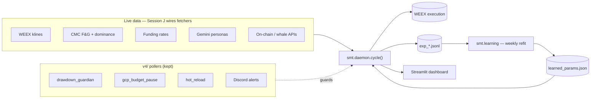

### 2. Daemon cycle (per-tick sequence)
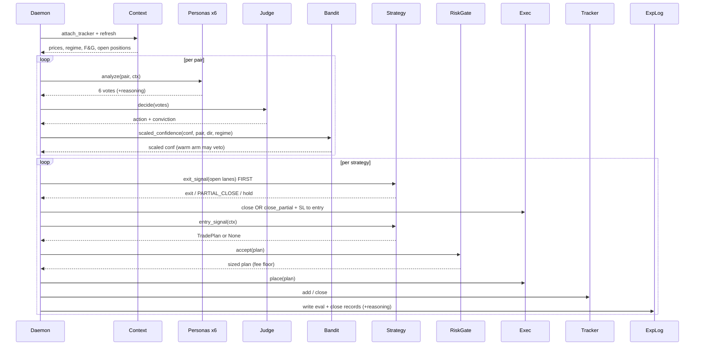

### 3. core/ — execution-side components
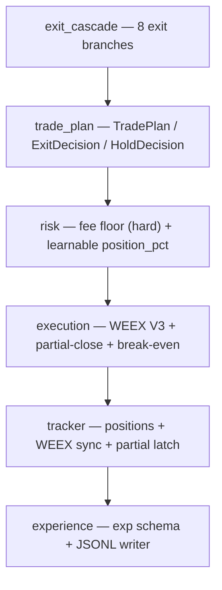

### 4. personas/ + JUDGE — the decision
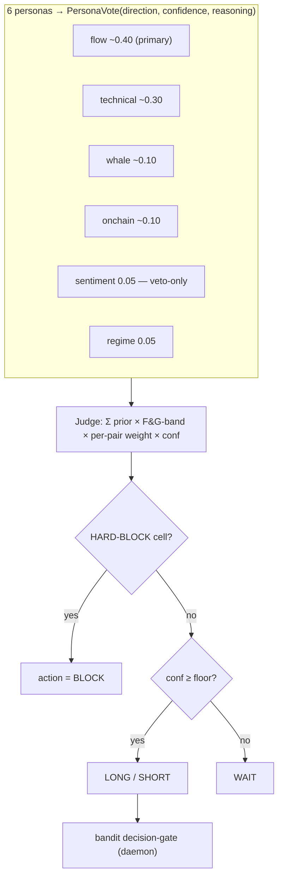

### 5. learning/ — the loop
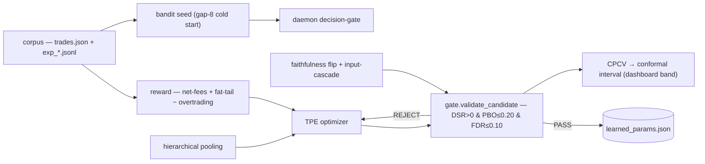

### 6. Experience-data lifecycle (the exp schema)
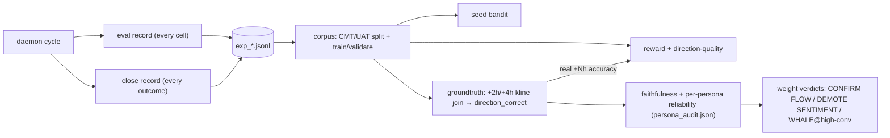

### 7. Lanes & exit cascade (per pair)
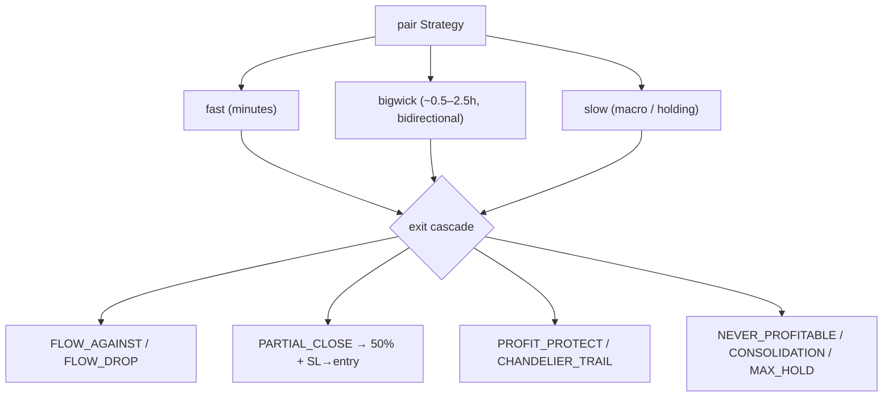

### 8. Forward: agent-interop layer (hackathons + product)
> Build once as a thin wrapper around the personas; turns each into a discoverable, paid,
> identity-bearing agent. See `hackathons/` + the per-hackathon SYSTEM_DESIGN docs.
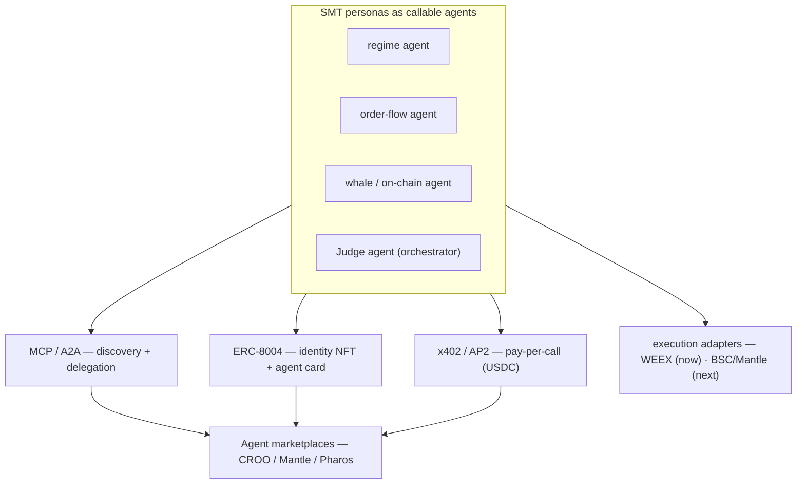

### 9. Session F — validation gates & faithfulness (concept visuals)
> The bot's bullshit filter. Half 1 (DSR/PBO/FDR/CPCV/conformal) refuses to trust a **lucky
> backtest**; Half 2 (flip + cascade) refuses to trust a **fake explanation**; underneath both, the
> ground-truth join grades everything against **independent reality** instead of the bot's own logs.

**The villain — overfitting (why every gate exists):**
```
try 2000 random settings on past data, keep the "best":
  ░░░░░░░░░▓░░░░░░░   ▓ = looks amazing BY LUCK
  (like flipping 1000 coins, keeping the one that hit 9/10 heads — it's not "good at heads")
deploy live → it falls apart.  Session F = the tests that tell luck from skill.
```

**DSR — Deflated Sharpe: discount the score for how many tries it took**
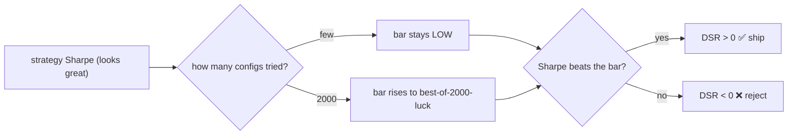

**PBO — does the in-sample winner survive out-of-sample?**
```
split history:  [ half A ]  [ half B ]
 pick best on A  ─────────▶  test it on B
   still good on B → real edge      → PBO low  ✅
   bombs on B      → memorized luck → PBO > 0.20 ❌
 "aced the practice test, bombed the real exam"
```

**FDR — don't shout 'edge!' every time noise pings** · **CPCV — test unseen data without cheating**
```
FDR (8 pairs × many cells):              CPCV (purge + embargo):
  ███ tiny p = real    ░░░ big p = noise   time → [train][PURGE][TEST][EMBARGO][train]
  keep fakes ≤ 10% of "discoveries"                       ↑drop overlap   ↑drop leak
  none survive → reject (fdr > 0.10)       no future leaks into the past → honest OOS Sharpe
```

**Conformal — an honest band, not a fake exact number**
```
  $20 |───────●───────| $80      "≈90% sure tomorrow lands in here"
         expected $50             (vs pretending you know it's exactly $50)
```

**Faithfulness flip — is the bot's 'why' real, or made up?**
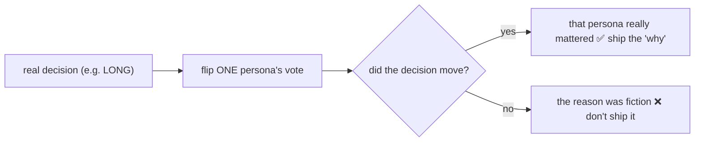

**Input-cascade — 6 advisors agreeing, or 1 broken feed wearing 6 hats?**
```
all personas agree ─┬─ independently?      → real consensus ✅
                    └─ all reading 1 feed? → one opinion ×6 ❌  (the V3.2.124 "wide net of wrong")
```

**Ground-truth join — stop grading your own homework**
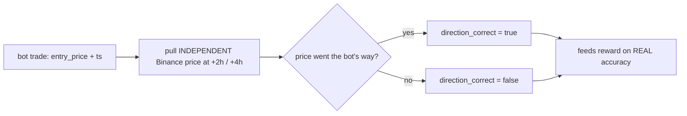

1. **No trading logic in daemon.** V6.0 mistake: 14.6K-line daemon
   mixed loop + logging + entry rules + exit rules + WEEX quirks. Now:
   daemon is the loop; everything else is a callable.

2. **Per-pair = per-class.** Each pair's quirks (BTC institutional
   floor, ADA whale-first frontrunning, DOGE 200d-EMA binary) live in
   ONE file — `smt/pairs/<pair>.py`. No per-pair dicts scattered
   across two monoliths.

3. **Persona vote sources are interchangeable.** Adding OnChainPersona
   (V6.0.8) took 1K+ lines in a monolith; in this layout it's 1 file
   + 1 line in `smt/personas/judge.py`.

4. **Execution = stateless thin wrapper.** All WEEX quirks (camelCase,
   POST_ONLY rejection -1135, lane-suffix stripping for -1142, HTTP
   429 sentinel) live in `core/execution.py` and nowhere else.

5. **Risk = one fee gate + one sizing function.** The fee floor
   (`net > fees`) is the ONLY un-disableable check. Sizing is learnable.

6. **Learning = read-only against the trading loop.** Learning modules
   produce parameter values (per-pair thresholds, persona weights);
   trading modules read them at startup or hot-reload TTL. No
   mid-cycle learner write reaches into trade decisions.

## Read flow (configs)

- `v4/smt_settings.json` (hot-reload, 60s TTL): ops flags + version
- `v4/confidence_calibration.json`: weekly calibration refit output
- `CONFIG` dicts inside each `smt/pairs/<pair>.py`: per-pair baseline tunables
- (Session D) `v4/learned_params.json`: Optuna TPE output that pair
  Strategy classes load at startup

## Write flow (logs + alerts)

- `v4/logs/daemon_v6_1_0_*.log`: per-cycle log lines (`logging` module)
- `v4/rl_training_data/exp_*.jsonl`: per-trade TrainData (learner input)
- `docs/data/{trades,versions}.json`: dashboard refresh (built by
  `scripts/build_trade_history.py` from the above two)
- Discord webhooks (`v4/trade_alert_logger.py`, `v4/drawdown_guardian.py`,
  `cloud_functions/smt_cost_digest`, `cloud_functions/smt_budget_pause`)
- WEEX `upload_ai_log_to_weex` (track-record / competition modes)

## External pollers (kept in v4/, polled by daemon main loop)

- `v4/drawdown_guardian.py` — rolling window max loss → `pause_trading=true`
- `v4/gcp_budget_pause.py` — GCS flag-file on 90% GCP budget breach
- `v4/hot_reload.py` — `smt_settings.json` 60s TTL re-read

Each is checked at the top of every cycle alongside `ctx.refresh()`.

## Ports of V6.0 lessons (preserved in scaffold docstrings + TODOs)

| V6.0 lesson | Lives in v6.1 |
|---|---|
| 0.12% round-trip fee | `smt/core/risk.ROUND_TRIP_FEE_PCT` |
| Lane-suffix stripping (-1142) | `smt/core/execution.strip_lane_suffix` |
| HTTP 429 → -1.0 price sentinel | `smt/core/execution.ExecutionClient.get_price` docstring |
| POST_ONLY rejection (-1135) | `smt/core/execution` docstring |
| `<SYM>#<lane>` canonical tracker key | `smt/core/tracker.split_key` |
| Single Discord trade-alert hook | `smt/core/tracker.PositionTracker.add/close` (port from `v4/trade_alert_logger.py`) |
| Per-pair regime authoritative (V5.0.7) | `smt/personas/regime.RegimePersona` docstring |
| BTC-anchored gate BANNED (V4.2.3) | `smt/personas/regime` docstring |
| NEUTRAL on persona rate-limit | `smt/personas/base` module docstring |
| V5.0.9 raw_judge bypass contract | `smt/personas/judge.JudgePersona` docstring |
| V3.2.277 HARD-BLOCK catastrophic combos | `smt/personas/judge` docstring + TODO Session C |
| V6.0.7b PAIR_SENTIMENT_CATALYST_SURFACE | `smt/personas/sentiment` docstring + TODO Session C |
| V6.0.7 PAIR_JUDGE_PERSONA_WEIGHTS rebalance | `smt/personas/judge` docstring + Session C |
| V6.0.6 SLOW-HOLD per-pair entry rules | each `smt/pairs/<pair>.py` CONFIG.slow |
| V6.0.9 PAIR_FLOW_EXIT_THRESH_BY_REGIME (×3 dicts) | `smt/personas/flow` docstring |
| V6.0.6 B.10 cross-pair cascade | `smt/context/global_context.cascade_state` |
| Wick lane confirmed-dead (V4.2.5 / V6.0.7b) | NOT ported — left as comment only |
| `force_exit_loss_pct` RETIRED (V6.0.9) | NOT ported — dead field |
| CoinGecko news 401 storms | NOT ported — SentimentPersona doesn't include it |
| CoinDesk veto stale corpus | NOT ported — SentimentPersona doesn't include it |
