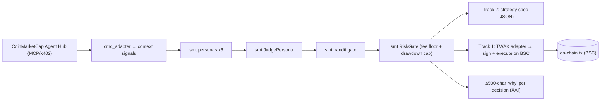

# BNB Hack: AI Trading Agent — Smart Money Trading

**Hackathon:** BNB Hack: AI Trading Agent Edition (CoinMarketCap × Trust Wallet × BNB Chain) ·
$36,000 · build window Jun 3–21 · **submit by 2026-06-21** · live-trading window Jun 22–28.
**Why this one fits best:** it's an *AI trading agent* hackathon — SMT's brain maps directly, and
the live window coincides with our fast-lane PROFITABLE target (Jun 28).

---

## What we ship (both tracks; Track 2 first)

### Track 2 — Strategy Skills ($6k, no execution) ← do this first, near drop-in
A **CoinMarketCap-data Skill** that turns market state into a backtestable strategy spec — exactly
our regime + multi-persona scoring, authored as an LLM Skill. Deliverable is a strategy spec, not a
live trader. **Lowest effort, highest-probability placement.**

### Track 1 — Autonomous Trading Agents ($24k, live PnL on BSC)
The SMT brain reads CMC data, decides, and a **Trust Wallet Agent Kit (TWAK)** adapter signs +
executes on BSC, within our risk guardrails (fee floor + drawdown cap + per-trade limits). On-chain
registration before Jun 22. Targets the "Best Use of TWAK" special prize via genuinely hands-off,
self-custodial execution.

---

## Components reused from `smt/` (imported, not copied)

| Need | Reused from main repo | Folder-local (custom) |
|---|---|---|
| Persona votes | `smt.personas.{flow,technical,whale,onchain,sentiment,regime}` | — |
| Aggregation | `smt.personas.judge.JudgePersona` | — |
| Risk / fee floor | `smt.core.risk.RiskGate` | drawdown-cap wrapper (comp rule) |
| Conviction gate | `smt.learning.bandit.ContextualBandit` | — |
| Market data | — | CMC Agent Hub adapter → `context.*_signal` |
| Execution | (WEEX adapter not used here) | **TWAK/BSC adapter** (Track 1 only) |

> The CMC adapter populates the same `context["flow_signal"]/["technical_signal"]/…` dicts the
> personas already read, so the brain is untouched. The TWAK adapter implements the same
> `place/close` shape as `smt.core.execution.ExecutionClient` — a sibling adapter, not a fork.

---

## System design

## BUIDL submission
Use the **shared blocks** in `../README.md` (Details / About / How-it-works) verbatim — they fit
this hackathon as-is. **Deltas for BNB:** lead with "live PnL with a drawdown cap" (Track 1) and
"backtestable CMC Skill" (Track 2); name CMC Agent Hub + Trust Wallet Agent Kit + BNB AI Agent SDK
as the integration surfaces; on-chain proof = agent wallet address + BSC tx hash.

## Plan / status
- [ ] Track 2: wire `cmc_adapter` → run personas+judge → emit strategy spec + backtest (no exec).
- [ ] Track 1: implement `TWAKExecutionAdapter` (sign/execute/reduce-only) behind the exec interface.
- [ ] On-chain register agent wallet (CLI `twak compete register`) before Jun 22.
- [ ] Risk guardrails: drawdown cap (DQ if >30%), per-trade + daily limits, token allowlist.
- [ ] Demo video + public repo + README (this file).

See `integration_stub.py` for the adapter shapes.
