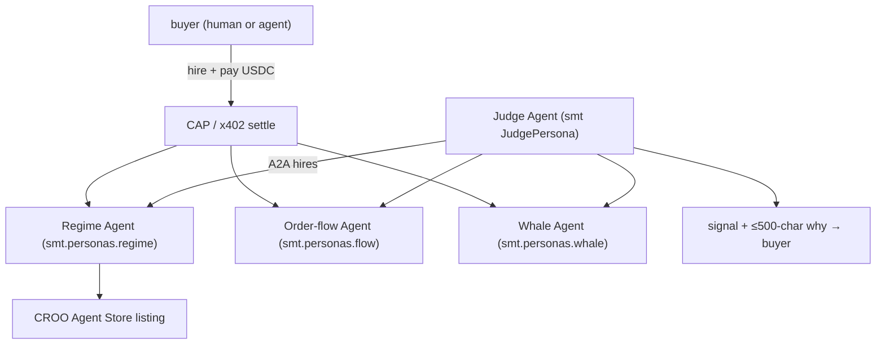

# CROO Agent Hackathon — Smart Money Trading

**Hackathon:** CROO Agent Hackathon · ~$10,200 · **submit by 2026-07-12** (~28 days). Build **paid,
A2A-callable agents** on the CROO Agent Store via **CAP** (CROO Agent Protocol; settles USDC
on-chain). Tags: AI Agents · A2A · OpenAI · Blockchain · DeFi.

---

## What we ship

Expose SMT's personas as **paid, callable agents** on the CROO Agent Store. A buyer (human *or*
another agent) can **hire the "SMT Regime Agent"** (or order-flow / whale agent) for a signal and
pay per call in USDC via CAP. The **Judge Agent** orchestrates — it can itself *hire* the persona
agents (A2A composability), which is exactly the network effect CROO rewards. Tracks: "Research &
Intelligence Agents" and/or "DeFi / On-chain Ops Agents".

> This monetizes the brain with **zero trading-execution risk** — we sell *reasoning*, not orders.
> It's also the cleanest realization of the "personas for sale" model: a user composes our persona
> agents with their *own* thresholds/strategy.

---

## Components reused from `smt/` (imported, not copied)

| Need | Reused | Folder-local (custom) |
|---|---|---|
| Each callable agent | `smt.personas.{regime,flow,whale,onchain,technical,sentiment}` | CAP wrapper per persona |
| Orchestrator agent | `smt.personas.judge.JudgePersona` | A2A "hire-the-personas" flow |
| Pay-per-call | — | **CAP integration (USDC settle) + x402 fallback** |
| Listing | — | Agent Store manifest + MIT license |

## System design

## BUIDL submission
Use the **shared blocks** in `../README.md`. **Deltas for CROO:** frame each persona as a *paid,
composable A2A service* ("hire the SMT Regime Agent"); CAP integration + Agent Store listing +
permissive license are the submission requirements; demo shows one agent hiring another (A2A) with
an on-chain settlement.

## Plan / status
- [ ] Wrap one persona (Regime) as a CAP-callable agent; price per call; settle USDC.
- [ ] Judge Agent hires persona agents over A2A; returns signal + ≤500-char why.
- [ ] List on CROO Agent Store; MIT license; ≥3 unique counterparties / ≥5 buyers (reward criteria).
- [ ] Demo video (≤5 min) + public repo + README (this file).

See `integration_stub.py` for the CAP-callable agent shape.
