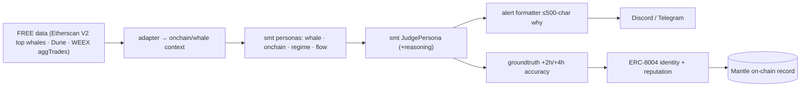

# Mantle Turing Test 2026 — Smart Money Trading

**Hackathon:** The Turing Test Hackathon 2026 — Phase 2 "AI Awakening" · Mantle ecosystem · **$100K total** ·
DoraHacks. Full rubric + awards → **`CRITERIA.md`** · official: https://docs.byreal.io/turing-test-hackathon/evaluation-criteria
**Submission repo (operator-linked):** https://github.com/JannetEkka/smart-money-trading

**Tracks entered (max 2 allowed — operator chose BOTH, 2026-06-16):**
1. **AI Alpha & Data** — sponsor **Mirana Ventures**. *Strong, natural fit (ship-ready).*
2. **AI Trading & Strategy** — sponsors **Bybit + BGA**. *Stretch — on-chain gap, see below.*

> ⚠ **Deadline:** the earlier note here said 2026-06-15, which is PAST (today 2026-06-16). Operator to
> confirm the live DoraHacks submission window before we treat any date as real (don't trust the old one).

---

## Track 1 — AI Alpha & Data (Mirana Ventures) — natural fit
Track ask: *"smart money tracking and on-chain anomaly detection bots via Telegram and Discord."*
That is literally SMT. The whale + on-chain + regime personas score smart-money activity and flag
anomalies; the Judge aggregates; each call broadcasts to **Discord/Telegram** with a ≤500-char "why."
Signal-only, no execution — and the hackathon's *radical-transparency* theme IS our XAI story.

## Track 2 — AI Trading & Strategy (Bybit + BGA) — honest gap
Track ask: *"AI quant bots and macro-driven smart contracts, with Python and Solidity templates and
Bybit API support."*

| Track wants | SMT has today | Gap / bridge |
|---|---|---|
| AI quant bot (Python) | ✅ the whole `smt/` engine | — |
| Bybit API support | uses **WEEX** | add a Bybit execution adapter — `core/execution` already anticipates per-exchange adapters (multi-exchange note, PLAN.md) |
| macro-driven smart contract (Solidity / Mantle) | none (off-chain Python) | a small Mantle contract that records/executes the Judge's macro-**REGIME** call (persona → on-chain trigger) |
| deployed on Mantle | off-chain | REQUIRED for Grand Champion + 20-Deploy award (`CRITERIA.md`) |

> **Recommendation:** lead with **Alpha & Data** (ship-ready, no execution). Treat **Trading &
> Strategy** as the on-chain extension — the ERC-8004 identity + a minimal Mantle "decision-record /
> agent-trigger" contract is the smallest thing that satisfies "≥1 AI function callable on-chain."

---

## What we ship (one brain, both tracks)

An **AI Alpha bot**: SMT's whale + on-chain + regime personas score smart-money activity and flag
anomalies, broadcast as **Discord/Telegram alerts** with a ≤500-char "why" per call. Add an
**ERC-8004 agent identity** on Mantle (identity NFT + agent-card JSON of endpoints + a reputation that
accrues from logged +2h/+4h call accuracy) to satisfy the on-chain identity + benchmark requirement —
a clean, bounded integration. The same brain, plus a Bybit adapter + a macro-REGIME Mantle contract,
is the Trading & Strategy extension.

## Components reused from `smt/` (imported, not copied)

| Need | Reused | Folder-local (custom) |
|---|---|---|
| Whale / on-chain / regime reads | `smt.personas.{whale,onchain,regime,flow}` | FREE adapters (Etherscan V2 top-whale tx + Dune + WEEX aggTrades) |
| Aggregation + "why" | `smt.personas.judge.JudgePersona` | alert formatter (≤500 chars) |
| Direction grading / reputation input | `smt.learning.groundtruth` (+2h/+4h join, Session F) | maps logged accuracy → on-chain reputation |
| Discord alert hook | `v4/trade_alert_logger.py` | Telegram mirror |
| Identity / reputation | — | **ERC-8004 agent card + identity NFT (Mantle)** |
| (Track 2 only) execution | `smt.core.execution` interface | **Bybit adapter** + macro-REGIME Mantle contract |

## System design

## BUIDL submission
See `BUIDL.md` (paste-ready) + the **shared blocks** in `../README.md`. Lead with "smart-money +
on-chain anomaly detection → Discord/Telegram, with an on-chain ERC-8004 identity and a
transparency-first 'why' on every alert." Full judging rubric in `CRITERIA.md`.

## Plan / status
- [ ] Wire one FREE on-chain source (Etherscan V2 top-whale tx, or Dune) → context signals.
- [ ] Run whale+onchain+regime personas → JUDGE → ≤500-char alert.
- [ ] Discord webhook (reuse `v4/trade_alert_logger.py`) + Telegram mirror.
- [ ] ERC-8004 agent-card JSON + identity NFT mint (Mantle testnet); reputation = logged +2h/+4h accuracy.
- [ ] **(Track 2)** Bybit execution adapter + minimal macro-REGIME Mantle contract (Solidity).
- [ ] Verify contract on Mantle Explorer; ≥1 AI function callable on-chain (20-Deploy award).
- [ ] Public frontend + demo video (≥2 min) + README.

See `integration_stub.py` for the alert-bot + agent-card shapes.
