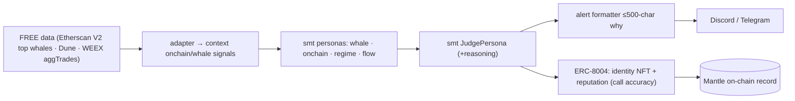

# Mantle Turing Test 2026 — Smart Money Trading

**Hackathon:** The Turing Test Hackathon 2026 (Mantle × Bybit × Byreal × BGA) · Phase 2 "AI
Awakening", $100k · **submit by 2026-06-15** ⚠️ (~1 day). **Track: "AI Alpha & Data" — smart-money
tracking + on-chain anomaly bots via Telegram/Discord.** This is SMT's *origin* — the lightest-scope
entry: **signal-only, no on-chain execution.**

---

## What we ship

An **AI Alpha bot**: SMT's whale + on-chain + regime personas score smart-money activity and flag
anomalies, broadcast as **Discord/Telegram alerts** with a ≤500-char "why" per call. Add an
**ERC-8004 agent identity** (identity NFT + agent card JSON listing the agent's endpoints + a
reputation that accrues from logged call accuracy) to satisfy the on-chain-benchmark + identity
requirement — a clean, bounded integration, no trading execution.

> Why this track, not "AI Trading & Strategy": no execution adapter needed, so it ships in a day,
> and the *radical-transparency* theme is literally our XAI story.

---

## Components reused from `smt/` (imported, not copied)

| Need | Reused | Folder-local (custom) |
|---|---|---|
| Whale / on-chain / regime reads | `smt.personas.{whale,onchain,regime,flow}` | FREE adapters (Etherscan V2 top-whale tx + Dune + WEEX aggTrades) |
| Aggregation + "why" | `smt.personas.judge.JudgePersona` | alert formatter (≤500 chars) |
| Discord alert hook | `v4/trade_alert_logger.py` | Telegram mirror |
| Identity / reputation | — | **ERC-8004 agent card + identity NFT mint** |

## System design

## BUIDL submission
Use the **shared blocks** in `../README.md`. **Deltas for Mantle:** lead with "smart-money tracking
+ on-chain anomaly detection, broadcast to Discord/Telegram, with an on-chain ERC-8004 identity and
a transparency-first 'why' on every alert." Emphasize the radical-transparency theme. No execution
claims (signal product).

## Plan / status
- [ ] Wire one FREE on-chain source (Etherscan V2 top-whale tx, or Dune) → context signals.
- [ ] Run whale+onchain+regime personas → JUDGE → ≤500-char alert.
- [ ] Discord webhook (reuse `v4/trade_alert_logger.py`) + Telegram mirror.
- [ ] ERC-8004 agent card JSON + identity NFT mint (testnet); reputation = logged accuracy.
- [ ] Demo video + public repo + README (this file).

See `integration_stub.py` for the alert bot + agent-card shapes.
