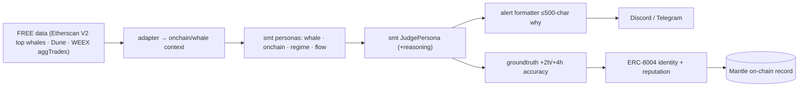

# Mantle Turing Test 2026 — Smart Money Trading

**Hackathon:** The Turing Test Hackathon 2026 — Phase 2 "AI Awakening" · Mantle ecosystem · **$100K total** ·
DoraHacks. Full rubric + awards (official): https://docs.byreal.io/turing-test-hackathon/evaluation-criteria
**Submission repo (operator-linked):** https://github.com/JannetEkka/smt-mantle

**Tracks entered (max 2 allowed — operator chose BOTH, 2026-06-16):**
1. **AI Alpha & Data** — sponsor **Mirana Ventures**. *Strong, natural fit (ship-ready).*
2. **AI Trading & Strategy** — sponsors **Bybit + BGA**. *Stretch — on-chain gap, see below.*

> ⚠ **Deadline:** the earlier note here said 2026-06-15, which is PAST (today 2026-06-16). Operator to
> confirm the live DoraHacks submission window before we treat any date as real (don't trust the old one).

---

## Track 1 — AI Alpha & Data (Mirana Ventures) — natural fit
Track ask: *"smart money tracking and on-chain anomaly detection bots via Telegram and Discord."*
That is literally SMT. The whale + on-chain + regime personas score smart-money activity and flag
anomalies; the Judge aggregates; each call broadcasts to **Discord/Telegram** with a ≤500-char "why."
Signal-only, no execution — and the hackathon's *radical-transparency* theme IS our XAI story.

## Track 2 — AI Trading & Strategy (Bybit + BGA) — more reachable than it looks
BGA's Part B (50 pts) rewards **transparency + reducing the retail-vs-institutional information gap —
explicitly NOT the highest PnL** ("we are rewarding better systems"). That is SMT's thesis exactly.
And the technical criterion accepts **"meaningful use of Bybit API OR on-chain logic"** — so our Mantle
contract satisfies it; **Bybit is optional upside, not required.**

| Track wants | SMT has | Note |
|---|---|---|
| AI quant bot (Python) | ✅ the whole `smt/` engine | core |
| Bybit API **or on-chain logic** | ✅ `SMTAgentRegistry` on-chain logic | Bybit adapter = optional upside |
| Transparency & verifiability (7.5) | ✅ white-box votes + faithfulness + on-chain reputation | strong |
| Strategy design & risk mgmt (7.5) | ✅ validation gates (DSR/PBO/CPCV) + fee-floor + drawdown guardian | strong |
| Deployed on Mantle | 👤 deploy `SMTAgentRegistry.sol` | Part A "Technical (15)" wants end-to-end on Mantle |

> **Recommendation:** both tracks share one Mantle deploy. Lead **Alpha & Data** on the **Trading
> Strategy path** (verifiable edge + auditability + risk management — where Session F shines); pitch
> **Trading & Strategy** on the **BGA ethos** (transparency / anti-information-asymmetry).

---

## What we ship (one brain, both tracks)

An **AI Alpha bot**: SMT's whale + on-chain + regime personas score smart-money activity and flag
anomalies, broadcast as **Discord/Telegram alerts** with a ≤500-char "why" per call. Add an
**ERC-8004 agent identity** on Mantle (identity NFT + agent-card JSON of endpoints + a reputation that
accrues from logged +2h/+4h call accuracy) to satisfy the on-chain identity + benchmark requirement —
a clean, bounded integration. The same brain, plus a Bybit adapter + a macro-REGIME Mantle contract,
is the Trading & Strategy extension.

## Components reused from `smt/` (imported, not copied)

| Need | Reused | Folder-local (custom) |
|---|---|---|
| Whale / on-chain / regime reads | `smt.personas.{whale,onchain,regime,flow}` | FREE adapters (Etherscan V2 top-whale tx + Dune + WEEX aggTrades) |
| Aggregation + "why" | `smt.personas.judge.JudgePersona` | alert formatter (≤500 chars) |
| Direction grading / reputation input | `smt.learning.groundtruth` (+2h/+4h join, Session F) | maps logged accuracy → on-chain reputation |
| Discord alert hook | `v4/trade_alert_logger.py` | Telegram mirror |
| Identity / reputation | — | **ERC-8004 agent card + identity NFT (Mantle)** |
| (Track 2 only) execution | `smt.core.execution` interface | **Bybit adapter** + macro-REGIME Mantle contract |

## System design

## BUIDL submission
See `BUIDL.md` (paste-ready) + the **shared blocks** in `../README.md`. Lead with "smart-money +
on-chain anomaly detection → Discord/Telegram, with an on-chain ERC-8004 identity and a
transparency-first 'why' on every alert." Official judging rubric: the Byreal evaluation-criteria page.

## Build status + remaining

**Built + tested this session** (`pytest tests/test_mantle_bridge_smoke.py` — 7 green; full suite 197):
- ✅ `contracts/SMTAgentRegistry.sol` — ERC-8004-style identity + reputation + on-chain
  `recordDecision` (the AI function callable on-chain) + `gradeDecision` (reputation from +2h/+4h).
- ✅ `onchain.py` — web3.py bridge, graceful-degrade (no web3/RPC → signal-only); pure encoders +
  agent-card builder unit-tested.
- ✅ `alert_bot.py` — personas → JUDGE → ≤500-char "why" alert → Discord/Telegram + optional on-chain
  write. Runs **offline** (`python3 alert_bot.py`).
- ✅ `agent_card.json` (ERC-8004 card) · `hardhat.config.js` + `scripts/deploy.js` + `package.json`
  (Mantle Sepolia/mainnet deploy + Explorer verify).

**Remaining — operator:**
- [ ] 👤 Deploy + verify `SMTAgentRegistry` on Mantle (testnet ok); `registerAgent` + a few `recordDecision`.
- [ ] 👤 Demo video ≥2 min + DoraHacks form (repo · tracks · deployed address · video).
- [ ] (Track 2, optional) Bybit execution adapter + macro-REGIME Mantle contract.

See `integration_stub.py` for the alert-bot + agent-card shapes. (Step-by-step deploy/submit runbook +
the full rubric are kept in the operator's local notes, not in the public repo.)
